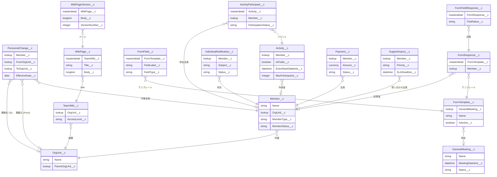

# データモデル概要

Willen 会員ポータルで使用するカスタムオブジェクトの全体構成と関係を説明します。

---

## カスタムオブジェクト一覧

| オブジェクト名 | API名 | 共有モデル | 概要 |
|---|---|---|---|
| 会員 | `Member__c` | Private | ポータル会員の基本情報（氏名・メール・種別・ステータス） |
| 支払い | `Payment__c` | Private | 年会費・各種費用の支払い記録 |
| 寄附 | `Donation__c` | Private | 会員からの寄附記録（金額・日付・方法） |
| 活動・イベント | `Activity__c` | Public Read/Write | イベント・活動の定義（公開/非公開・定員・参加費） |
| 活動参加者 | `ActivityParticipant__c` | ControlledByParent | イベント参加者1名1レコード（MasterDetail→Activity__c） |
| 組織単位 | `OrgUnit__c` | Public Read/Write | 部署・チーム等の組織階層 |
| 人事変更 | `PersonnelChange__c` | Private | 異動・昇進・退職等の人事変更記録 |
| 変更申請 | `ChangeRequest__c` | Private | 組織構成変更の申請・承認ワークフロー |
| バッチ通知 | `BatchNotification__c` | Private | バッチ処理による通知ログ |
| サポート問い合わせ | `SupportInquiry__c` | Private | 会員からのサポートチケット・SLA管理 |
| ポータル設定 | `PortalConfiguration__c` | Private | サイト設定・決済キー等の管理者設定（シングルトン） |
| チームWiki | `TeamWiki__c` | Private | 組織単位に紐付くWikiスペース |
| Wikiページ | `WikiPage__c` | ControlledByParent | TeamWiki内の個別ページ（Markdown本文） |
| Wikiページ版 | `WikiPageVersion__c` | ControlledByParent | WikiPageの変更履歴（バージョニング） |
| 個別通知 | `IndividualNotification__c` | Private | 管理者から特定会員への個別メール通知 |
| 総会 | `GeneralMeeting__c` | Public Read/Write | 定期総会・臨時総会の開催情報 |
| フォームテンプレート | `FormTemplate__c` | Public Read/Write | 動的フォームの定義（質問構成） |
| フォームフィールド | `FormField__c` | ControlledByParent | FormTemplate内の個別フィールド定義 |
| フォーム回答 | `FormResponse__c` | Private | 会員によるフォーム回答（MasterDetail→FormTemplate__c） |
| フォームフィールド回答 | `FormFieldResponse__c` | ControlledByParent | 個別フィールドへの回答値 |

---

## 共有モデルの説明

| 共有モデル | 意味 |
|---|---|
| **Private** | レコードオーナーと上位権限ユーザーのみアクセス可。共有ルール・Apexシェアで追加付与 |
| **ControlledByParent** | 親レコードの共有設定を継承。子レコード単独では共有設定不可 |
| **Public Read/Write** | 全内部ユーザーが参照・編集可能 |

---

## オブジェクト関係図



---

## キー関係の詳細

### 会員 - 組織

```
OrgUnit__c (階層構造: 自己参照 ParentOrgUnit__c)
    └── Member__c (多:1 Lookup)
```

会員は1つの組織単位に所属します。組織単位は親子階層を持ちます（部門 > チーム等）。

---

### 人事変更 - 会員・組織

```
PersonnelChange__c
    ├── Member__c (対象者)
    ├── FromOrgUnit__c (異動元)
    └── ToOrgUnit__c  (異動先)
```

異動元・異動先はどちらも `OrgUnit__c` への Lookup です。同一フィールドではなく、それぞれ独立した項目です。

---

### フォーム回答 - 総会

```
GeneralMeeting__c
    └── FormTemplate__c (Lookup)
            ├── FormField__c (ControlledByParent)
            └── FormResponse__c (MasterDetail)
                    └── FormFieldResponse__c (ControlledByParent)
```

!!! note "フォームと総会の関係"
    `FormTemplate__c` は `GeneralMeeting__c` への Lookup（任意）を持ちます。総会の出欠確認フォームとして使用する場合に設定します。汎用フォームとして使う場合は空のままです。

---

### チームWiki - 組織

```
OrgUnit__c
    └── TeamWiki__c (Lookup)
            └── WikiPage__c (ControlledByParent)
                    └── WikiPageVersion__c (ControlledByParent)
```

WikiPage の更新は WikiPageVersion として履歴保存されます。

---

## オブジェクト設計上の注意点

!!! warning "ControlledByParent オブジェクトの共有設定"
    `ActivityParticipant__c`、`WikiPage__c`、`WikiPageVersion__c`、`FormField__c`、`FormFieldResponse__c` は共有モデルが `ControlledByParent` です。これらのオブジェクト単独で共有ルールを設定することはできません。親オブジェクトのアクセス権を変更することで制御します。

!!! tip "PortalConfiguration__c はシングルトン"
    `PortalConfiguration__c` は組織に1レコードのみ存在します。`PortalConfigController.savePortalConfig()` は `SetupOwnerId` を使った upsert で常に同一レコードを更新します。複数レコードを作成しないよう注意してください。
